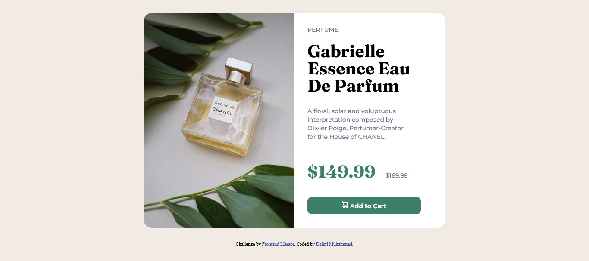

# Frontend Mentor - Product preview card component solution

This is a solution to the [Product preview card component challenge on Frontend Mentor](https://www.frontendmentor.io/challenges/product-preview-card-component-GO7UmttRfa). Frontend Mentor challenges help you improve your coding skills by building realistic projects. 

## Table of contents

- [Overview](#overview)
  - [The challenge](#the-challenge)
  - [Screenshot](#screenshot)
  - [Links](#links)
- [My process](#my-process)
  - [Built with](#built-with)
  - [Continued development](#continued-development)
  - [Useful resources](#useful-resources)
- [Author](#author)

## Overview

### The challenge

Users should be able to:

- View the optimal layout depending on their device's screen size
- See hover and focus states for interactive elements

### Screenshot

### Links

- Solution URL: [https://www.frontendmentor.io/solutions/responsive-landing-page-using-basic-css-D4GWnvaGuy](https://www.frontendmentor.io/solutions/responsive-landing-page-using-basic-css-D4GWnvaGuy)
- Live Site URL: [https://exquisite-rolypoly-87af5c.netlify.app/](https://exquisite-rolypoly-87af5c.netlify.app/)

## My process

### Built with

- Semantic HTML5 markup
- CSS custom properties
- Responsive Website

### Continued development

I want to learn more about responsive websites, as well as how to use them properly and correctly, because while working on this challenge I had a little difficulty

### Useful resources

- [CSS Layouting - Web Programming UNPAS](https://www.youtube.com/playlist?list=PLFIM0718LjIUu4Ju9GUL5zpLcuq08TKYr) - This video helped me to understand the concept and use of CSS Layouting.

## Author

- LinkedIn - [@dzikrimuhammad](https://www.linkedin.com/in/dzikrimuhammad/)
- Frontend Mentor - [@DMuhammad](https://www.frontendmentor.io/profile/DMuhammad)
- Twitter - [@edrxco](https://www.twitter.com/edrxco)
